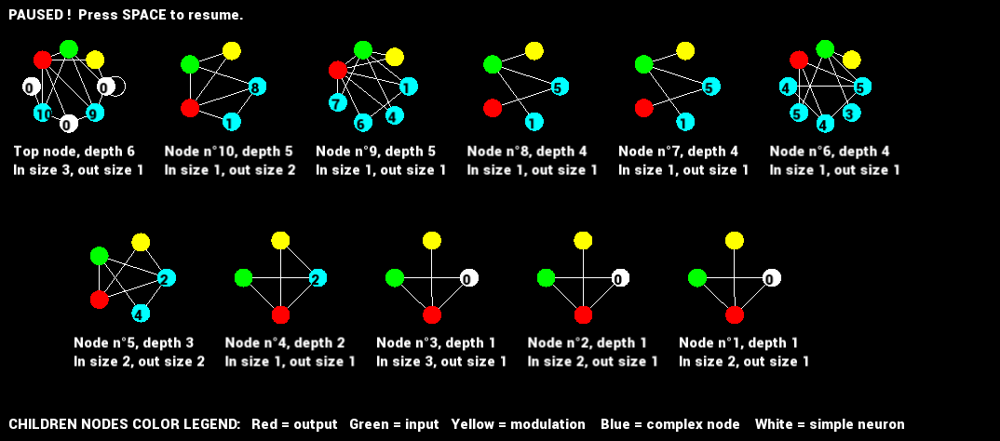

# RECURSIVE_NODES

Implements a 3 loops optimization algorithm to tackle reinforcement learning challenges. A population of plastic graph networks is meta-optimized by a custom genetic algorithm, which evolves both topology and floating point parameters. Networks use 3 factor Hebbian learning rules and local neuromodulation.

&nbsp;

  

&nbsp;
##### KNOWN BUGS: None, report any !
##### TODO: Save a model or a population, with boost.serialize. Then heap defragmentation.
&nbsp;
Several variants of the algorithms are implemented, change the active preprocessor directives in main.cpp or dllMain.h to compile a custom version. More info in the code.
The program can be compiled into an executable, to experiment on the implemented c++ trials. As of now, 3 trials are implemented: XoR with memorization, gym's cartpole, and the T-Maze. More to come !

It can also be compiled into a dll, to use in python with ctypes. One can then evaluate the algorithm on any python trial, like on openAI's gym's for instance. A demo can be found in python\gym_cartpole.py. It is still in developpement, so stick close to the demo's architecture if you dont want to run into undefined behaviours.

## Visual studio 2022 setup:

ISO C++20 because [branch predictor hints](https://en.cppreference.com/w/cpp/language/attributes/likely) are used to speed up network evaluation. To switch between dll and exe, go to Project Properties -> Configurations Properties -> General -> Configuration Type. 

The project requires SFML 2.5. if you wish to display the evolved topology. (It can be toggled on and off with the DRAWING preprocessor directive in dllMain.h or main.cpp before building.)

If SFML is used, the following DLLs must be placed in the same folder as the built file, whether compiling a .exe or a .dll :

### In debug mode, in RECURSIVE_NODES\x64\Debug:

  sfml-graphics-d-2.dll     sfml-system-d-2.dll     sfml-window-d-2.dll
  
  
### In release mode, in RECURSIVE_NODES\x64\Release:

  sfml-graphics-2.dll      sfml-system-2.dll     sfml-window-2.dll
  
 
##### To obtain those, download SFML 2.5.1.

#### Details

- I recommend toggling adress Sanitizer on (if you have it installed) when debuging the .exe . It MUST be disabled when debuging the DLL because of a VS bug. Found in  Project Properties -> C/C++ -> General -> Enable Adress Sanitizer  . 

- Sciplot's headers are in the repo but unused yet.
