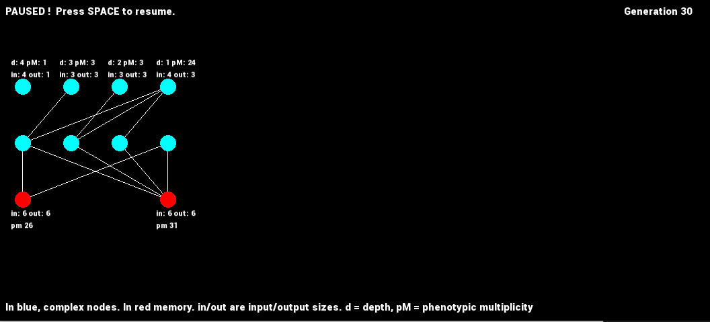

# RECURSIVE_NODES

Implements a 3 loops optimization algorithm to tackle reinforcement learning challenges. A population of plastic graph networks is meta-optimized by a custom genetic algorithm, which evolves both topology and floating point parameters. Networks use 3 factor Hebbian learning rules and local neuromodulation.
##### The algorithm does not use sparse connexions anymore, to be easier to port to GPU. The following visual are therefore obsolete, new ones coming soon.

&nbsp;

  

<em>Visualization of one network. The numbers inside circles correspond to the node 'Node n°X'.</em>

&nbsp;
##### KNOWN BUGS: None, but partial evaluation and gradient guided mutations are for now incompatible and will cause a crash.
##### IN PROGRESS: feed forward DNN memory with inline gradient descent.
##### TODO: New visuals. Heap defragmentation. GPU port only when sufficient gains.
&nbsp;

## USER GUIDE
&nbsp;
#### Several variations of the algorithm are implemented, change the active preprocessor directives in config.h to compile a custom version. More info in the file. The project can be compiled into an executable or a dll.
&nbsp;

With the executable, one can experiment with the algorithm, and use all of its features. It can be tested on the implemented c++ trials. As of now, 5 trials are implemented: XoR with memorization, gym's cartpole, T-Maze, N-Links pendulum, and Key-value memorization. More to come !

The dll has limited features, especially when it comes to the evolutionary algorithm. It is meant to be used in python with ctypes, for benchmarking on openAI's gym's (now gymnasium) for instance. A demo can be found in python\gym_cartpole.py. 

#### Example run:

- Compile a Release dll (Project Properties -> Configurations Properties -> General -> Configuration Type).
- Open a command prompt and navigate to the RECURSIVE_NODES folder. (Not the "python" subfolder)
 - Run `python python\gym_cartpole.py`

&nbsp;

## Visual studio 2022 setup:
&nbsp;

ISO C++20 is required. To switch between dll and exe, go to Project Properties -> Configurations Properties -> General -> Configuration Type. 

The project requires SFML 2.5, if you wish to display the evolved topology. (It can be toggled on and off with the DRAWING  preprocessor directive in config.h before building.)

If SFML is used, the following DLLs must be placed in the same folder as the built file, whether compiling a .exe or a .dll :

&nbsp;

### In debug mode, in RECURSIVE_NODES\x64\Debug:

  sfml-graphics-d-2.dll     sfml-system-d-2.dll     sfml-window-d-2.dll
  
  
### In release mode, in RECURSIVE_NODES\x64\Release:

  sfml-graphics-2.dll      sfml-system-2.dll     sfml-window-2.dll
  
&nbsp;

##### To obtain those, download SFML 2.5.1.

&nbsp;

#### Details

- I recommend toggling adress Sanitizer on (if you have it installed) when debuging the .exe . It MUST be disabled when debuging the DLL because of a VS bug. Found in  Project Properties -> C/C++ -> General -> Enable Adress Sanitizer  . 

- Sciplot's headers are in the repo but unused yet.
